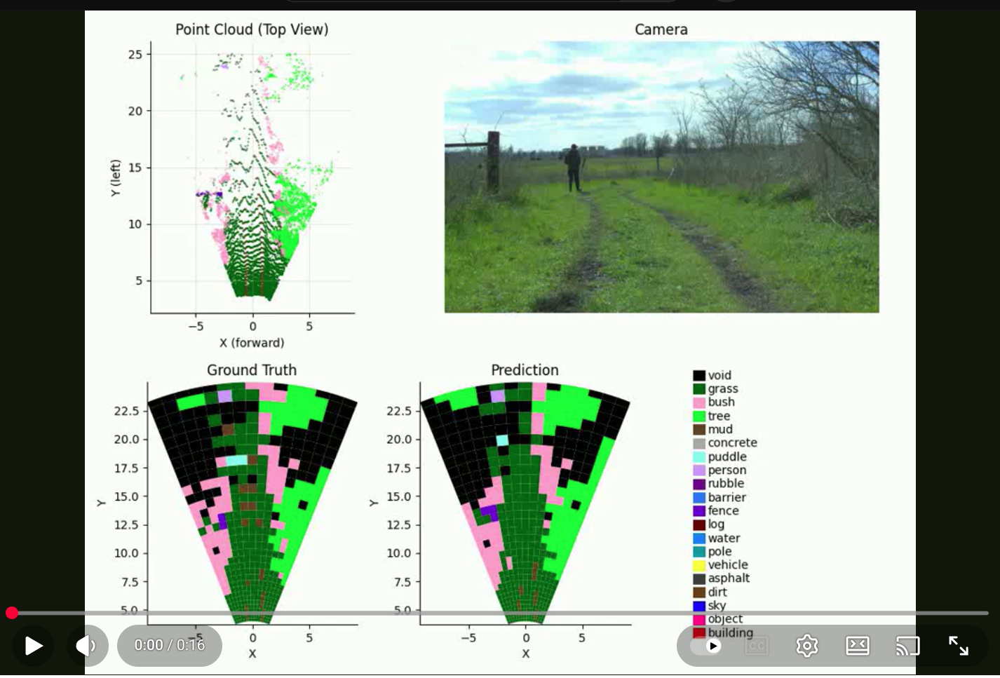
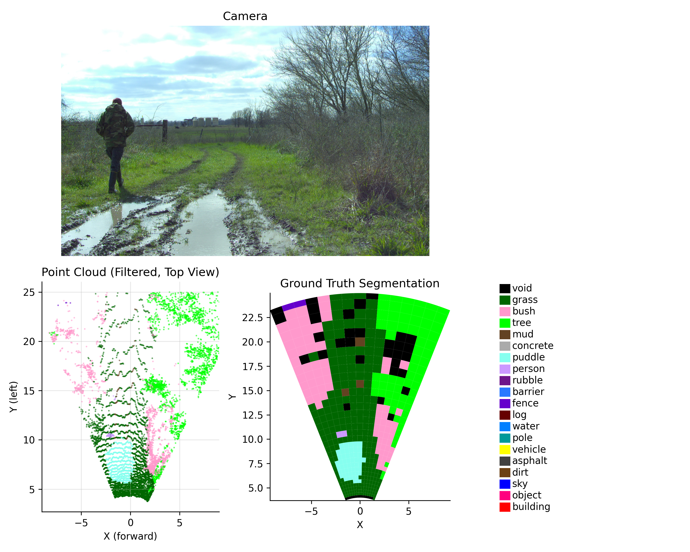
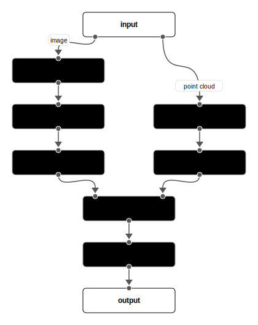
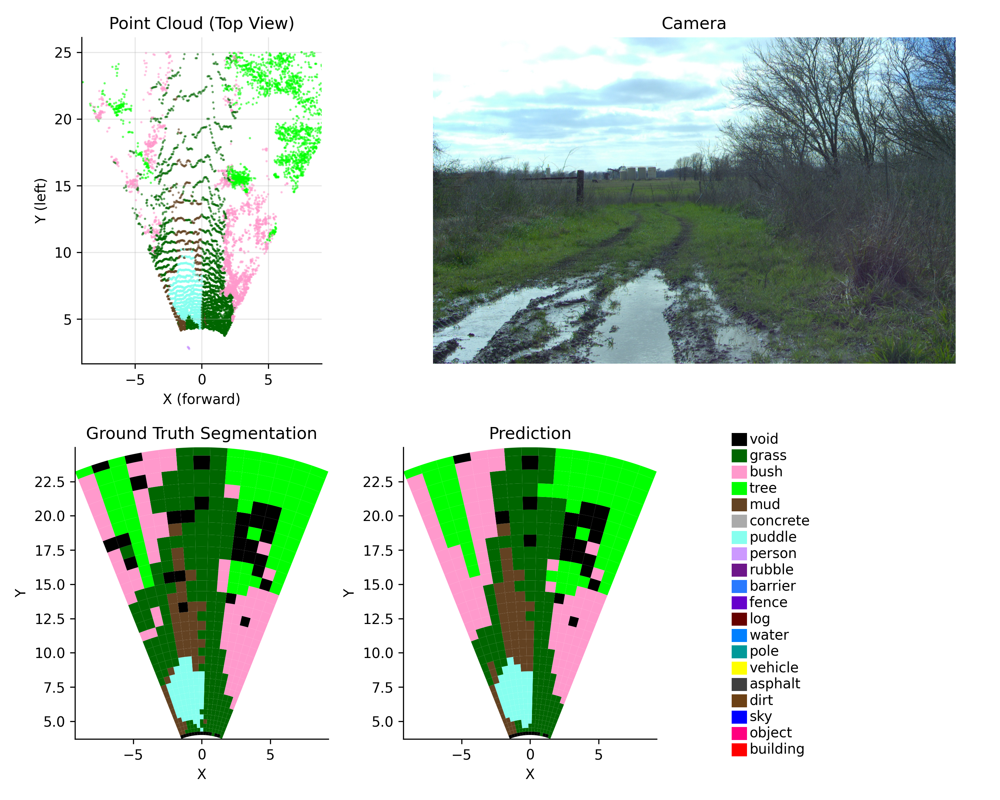

# Offroad BEV Segmentation for RELLIS-3D Dataset

[](https://www.youtube.com/watch?v=2X0Eym8zvbc)

## Overview

The goal of this project is to use the main idea from [BEVFusion](https://github.com/mit-han-lab/bevfusion) to train a custom model specifically for the off-road dataset [RELLIS-3D](https://github.com/unmannedlab/RELLIS-3D) to perform Bird Eye View (BEV) segmentation using both **camera** and **LiDAR** sensor data (multimodal fusion).

To deal with the uneven distribution of LiDAR points, a **polar grid** with custom spacing is used to generate the BEV segmentation map (see the example figure below). The choice of the polar grid alleviates the problem of sparseness of LiDAR points as the distance from the sensor increases. The ground truth segmentation is generated from the labeled LiDAR points, filtered by the camera's field of view.

The goal of the model is to fuse camera and LiDAR data to produce the BEV segmentation map, which can be readily used for tasks such as path planning and navigation.

<figure>
  <figcaption><strong>Example BEV Segmentation Map from sequence 00000, frame 104</strong></figcaption>
  
  
</figure>


## Performance

The trained checkpoint can be found [here](https://www.dropbox.com/scl/fi/nxt12g08gvwa59noqw70b/checkpoint_last_20251221_101423.pth?rlkey=08nwfx8hccpes3lgyoctrjso0&st=qihhigv6&dl=0)

The final test performance (IoU by class) is shown in the table below for the top 7 prevalent classes.

| Class | Prevalence | IoU|
|-------|-----|-----|
| grass | 0.5674 | 0.8213 |
| bush | 0.1884 | 0.5499 |
| void | 0.1442 | 0.6310 |
| tree | 0.0497 | 0.5661 |
| mud | 0.0251 | 0.2782 |
|concrete | 0.0097 | 0.2695 |
| puddle | 0.0065 | 0.1460 |


## Model Architecture

The full model architecture is shown in the figure below.
<figure>
  
</figure>

The model is composed of the following modules:

- **Input**: camera image and LiDAR point cloud.
- **ResNet Backbone** and **Feature Pyramid Network**: Both are used to extract the feature from the camera image.
- **Lift-Splat-Shoot**: The Lift-Splat-Shoot is used to transform the feature from the Feature Pyramid Network to the BEV feature.
- **Voxelization** and **Point Pillar Encoder**: These modules use the polar grid to voxelize the point cloud and encode the voxel features using point pillars.
- **Additive Fusion**: This module fuses the camera and LiDAR BEV feature.
- **Segmentation Head**: Produces the final segmentation map in the BEV.

## Dataset

The BEV segmentation is generated from the labeled LiDAR points. The original RELLIS-3D dataset is organized as follows (need to manually curate into this structure from the zip file, see original [repo](https://github.com/unmannedlab/RELLIS-3D)):
```
Rellis-3D/
├── 00000/
│   ├── calib.txt                   # Calibration parameters
│   ├── camera_info.txt             # Camera information
│   ├── transforms.yaml             # Coordinate transforms
│   ├── vel2os1.yaml                # Velodyne to OS1 transform
│   ├── poses.txt                   # Vehicle poses
|   ├── bev_seg_polar/              # Polar BEV segmentation maps (*.npy)
│   ├── os1_cloud_node_color_ply/   # Ouster OS1 point clouds (*.ply)
│   ├── os1_cloud_node_kitti_bin/   # Ouster OS1 point clouds in KITTI format (*.bin)
│   ├── os1_cloud_node_semantickitti_label_id/  # OS1 semantic labels (*.label)
│   ├── pylon_camera_node/          # Camera images (*.jpg)
│   ├── pylon_camera_node_label_color/  # Camera semantic labels (color) (*.png)
│   ├── pylon_camera_node_label_id/     # Camera semantic labels (ID) (*.png)
│   ├── vel_cloud_node_kitti_bin/   # Velodyne point clouds in KITTI format (*.bin)
│   └── vel_cloud_node_semantickitti_label_id/  # Velodyne semantic labels (*.label)
├── 00001/
│   └── [similar structure]
├── 00002/
│   └── [similar structure]
├── 00003/
│   └── [similar structure]
├── 00004/
│   └── [similar structure]
```

The `bev_seg_polar` directory is generated using the following code snippet:

```python
import sys
sys.path.append("/path/to/offroad_det_seg_rellis")
from offroad_det_seg_rellis.dataset.bev_segmentation import process_sequence

sequence_root = "/path/to/RELLIS-3D"
sequence_id_list = ["00000", "00001", "00002", "00003", "00004"]

polar_config = {
    "n_angle_bins": 15,
    "radial_mode": "linear",
    "radial_growth_rate": 0.1,
    "radial_min": 4.0,
    "radial_max": 25.0,
    "fov_add_margin": 0.1,
}
for sequence_id in sequence_id_list:
    process_sequence(
        sequence_root=sequence_root,
        sequence_id=sequence_id,
        filter_camera_fov=True,
        grid_type="polar",
        config=polar_config,
    )

```

## Training

The training is performed using the following command:

```bash
cd train
python train.py --config config.yaml
```

where `config.yaml` defines the hyperparameters and training configurations. The actual config can be found [here](config/full_model_v2.yaml).

## Test

The evaluation is performed using the following command:

```bash
cd train
python test.py --checkpoint path/to/checkpoint.pth
```

where `checkpoint.pth` is the path to the checkpoint file. A pre-trained checkpoint file can be found [here](https://www.dropbox.com/scl/fi/nxt12g08gvwa59noqw70b/checkpoint_last_20251221_101423.pth?rlkey=08nwfx8hccpes3lgyoctrjso0&st=qihhigv6&dl=0)

## Inference

The inference can be performed using the following code snippet:

```python
import sys
from pathlib import Path

sys.path.append("/path/to/offroad_det_seg_rellis")
from offroad_det_seg_rellis.inference import RellisPolarBevFusionInference
from offroad_det_seg_rellis.dataset.rellis_sequence import get_rellis_sequence_by_id

sequence_id = "00000"
frame_idx = 0

sequence_dir = Path(f"/path/to/RELLIS-3D/{sequence_id}").resolve()
inference = RellisPolarBevFusionInference(
    "/path/to/checkpoint.pth",
    device="cuda",
    cam_intrin_path=str(sequence_dir / "camera_info.txt"),
    lidar2cam_path=str(sequence_dir / "transforms.yaml"),
)

sequence = get_rellis_sequence_by_id(sequence_id)
image = sequence.get_image(frame_idx)
points = sequence.get_lidar_points(frame_idx)
bev_seg_pred = inference.predict(points, image).T

```

You can also visualize the prediction using the following code snippet:

```python
import sys
sys.path.append("/path/to/offroad_det_seg_rellis")
from offroad_det_seg_rellis.inference.plot_util import plot_prediction

fig = plot_prediction(inference, sequence_id, frame_idx)
```

which will produce the figure similar to the following:

<figure>
  <figcaption><strong>Example Prediction from sequence 00000, frame 0</strong></figcaption>
  
</figure>

